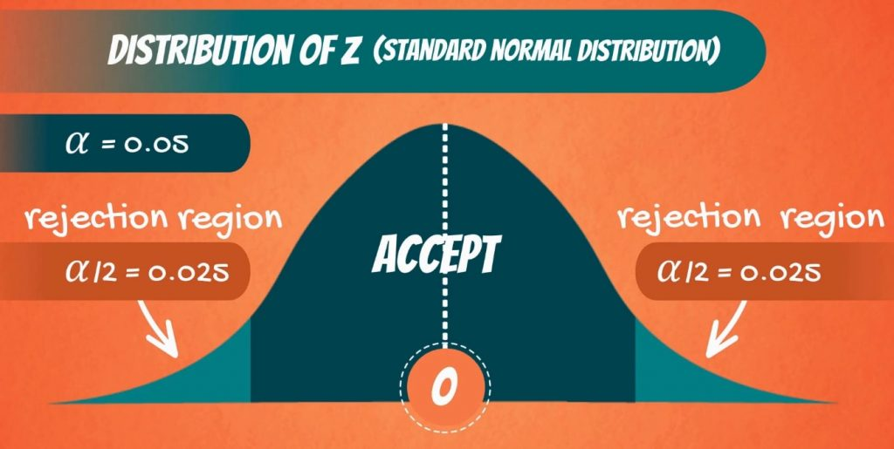

# Table of Contents
1. [Introduction](#z_intro)
2. [When to use?](#applicability)

# Introduction
- a.k.a. Z-score = $\dfrac{X - \mu}{\sigma}$, $\mu \,,\, \sigma$ are population mean and variance respectively.
    - notice that this Z-score will follow a **standard** normal distribution if the observations($X$) themselves follow a normal distribution
- **for a sample**, Z-score for sample mean = $\dfrac{\bar{X} - \mu}{\sigma/\sqrt{n}}$
    - this is used to determine how far the sample mean is from the population mean.
    - the denominator has $\dfrac{\sigma}{\sqrt{n}}$ instead of $\sigma$ because $Var.(\bar{X}) = \dfrac{\sigma^2}{n}$. [Refer to this proof](../Maths/README.md/#sm)
        - under the condition that each of the n observations drawn from the population has the same fixed variance ($\sigma^2$) will the above formula for variance for sample mean hold true.
        - this allows for the **population** to **not** be **restricted to normal distributions** only, **but restricts** them in terms of having **a fixed population variance**.
        - checkout the derivation linked, the variance of the individual observations gets summed.
    - Z-score for sample mean will follow a standard normal distribution even if the observations of the sample are not from a normal distribution.
        - this is because Central Limit Theorem makes it possible for large samples ($n > 30$) to have their sample mean follow a normal distribution, which makes the Z-score for sample mean follow a standard normal distribution. \
    $\bar{X} \sim \mathcal{N}\left(\mu, \dfrac{\sigma^2}{n}\right)$ (Note that for this case, although population mean and variance exist, that don't imply that the population is a normally distributed population)
        - but the observations of the sample (that form the sample mean as well) need to be **i.i.d.**.
        - **Note:** 30 is just a heuristic no. , found to work for certain distributions, but its no guarantee, and rather a rule of thumb
            - ideally, for the given population distribution, draw 100 samples, each of size n, and vary this n, till the corresponding 100 sample means appear to be normally distributed.
            - this can be done through sample-mean histogram plot
            - quantitatively, normality can be gauged through Shapiro-Walk or Jaque-Bara tests

# When to use?
- **population variance should be a known, fixed quantity**
    - **if population variance is unknown, use T-test instead**
- infer population properties from a given, considerably large sample
- comparing population means/variances of 2 different samples

# Z-test for one-sample mean
- i.e. you only have a single sample (set of n observations) for this
- using this sample, and the corresponding sample mean, we want to know whether a given no., $\mu_0$,  is the population mean ($\mu$) or not.

## Steps
- assume the null hypothesis: $H_0: \mu_0 = \mu$ , alternative hypothesis becomes that $\mu_0$,  is **not** the population mean ($\mu$)
- find sample mean $\bar{X}$
- $Z-score = \dfrac{\bar{X} - \mu_0}{\sigma/\sqrt{n}}$
- for a standard normal distribution, the non-rejection region is formed by the $[-a,a]$ region that corresponds to 95% probability (null hypothesis is **not statistically insignificant**, cannot reject it)
    - hence, the rejection region is $x > a \textrm{ and } x < -a$
    - rejection region means that if the Z-statistic (Z-score) is in this region, *it's safe to reject the null hypothesis*
    
    - observe that the rejection region has probability values < 0.05
        - and if a 1-sample mean's Z-score lies here, it means that the probability of the null hypothesis being true, i.e. that the given number $\mu_0$ represents the sample mean, is less than 0.05.
        - this $0.05$ is the generally chosen statistical significance threshold.
    - $a$ is the value where
        - integral of standard normal between $-a$ and $a$, which can be expressed as the integral from 0 to $a$ times 2, is equal to 95%
        - cumulative CDF till $x \le a$ of the standard normal distribution is 97.5%
        - this $a$ value is the **critical z-score value**
        - critical because if the Z-score of a given number is higher than this, the null hypothesis is statistically insignificant, hence can be safely rejected. 
    - **more generally speaking**
        - in the above examples, the significance level $\alpha = 0.05$
        - in general, for a given $\alpha$, the cumulative CDF till $x \le a$ of the standard normal distribution is $1-\dfrac{\alpha}{2}$
        - **critical z-score value** now depends on  $\alpha$
- check whether the Z-score is statistifically significant
    - if Z-score > critical z-score value ---> the null hypothesis is statistically insignificant, hence can be safely rejected.
        - this means that the given value is not the population mean.
    - else, fail to reject the null hypothesis, cannot say for sure whether the given value is the population mean.

## Confidence Intervals
- observe that in the Z-score formula, what if $\mu_0$ was very close , or even equal to $\bar{X}$
    - Z-score = 0, land up in non-rejection region, fail to reject the null hypothesis that $\bar{X} = \mu$
- now this $\mu_0$ can go lower or higher, with the Z-score still remaining in the non-rejection region
- this extent/interval in which the Z-score still remains in the non-rejection region $\Rightarrow$ Confidence Intervals
    - the extent of this interval is defined by the **critical z-score value** for the given statistical significance level $\alpha \Rightarrow z_{\alpha/2}$ 
- for a significance level $\alpha$, C.I. = $\bar{X} \pm z_{\alpha/2}\dfrac{\sigma}{\sqrt{n}}$
- this range tells you the allowed values of the population mean, given you have a single n-sized sample and the population variance is known.

# Z-test for two-sample means
- samples:
    - first sample: $X_1$ with $n_1$ size, population mean = $\mu_1$ , population variance = $\sigma^2_1$
    - second sample: $X_2$ with $n_2$ size, population mean = $\mu_2$ , population variance = $\sigma^2_2$
- for $Y = \bar{X_1} - \bar{X_2}$
    - we already know that $\mathbb{E}[\bar{X_1}] = \dfrac{\sigma_1^2}{n_1} \,,\, \mathbb{E}[\bar{X_2}] = \dfrac{\sigma_2^2}{n_2}$
    - $\mathbb{E}[Y] = \mathbb{E}[\bar{X_1} - \bar{X_2}] = \mathbb{E}[\bar{X_1}] - \mathbb{E}[\bar{X_2}] = \mu_1 - \mu_2$
    - $Var.(Y) = \mathbb{E}[(Y - \mathbb{E}[Y])^2] = \mathbb{E}[((\bar{X_1} - \mu_1) - (\bar{X_2} - \mu_2))^2] =\mathbb{E}[(\bar{X_1} - \mu_1)^2 + (\bar{X_2} - \mu_2)^2 - 2.(\bar{X_1} - \mu_1).(\bar{X_2} - \mu_2)] = \dfrac{\sigma_1^2}{n_1} + \dfrac{\sigma_2^2}{n_2} - 2(\mu_1\mu_2 - \mu_1\mu_2- \mu_1\mu_2 + \mu_1\mu_2) = \dfrac{\sigma_1^2}{n_1} + \dfrac{\sigma_2^2}{n_2}$ \
    Therefore, $Var.(Y) = \dfrac{\sigma_1^2}{n_1} + \dfrac{\sigma_2^2}{n_2}$
- hence, the difference in sample mean belongs to a normal distribution: $\mathcal{N}\left(\mu_1 - \mu_2 , \dfrac{\sigma_1^2}{n_1} + \dfrac{\sigma_2^2}{n_2}\right)$
- now, if z-score is defined as $Z = \dfrac{(\bar{X_1} - \bar{X_2}) - (\mu_1 - \mu_2)}{\sqrt{\dfrac{\sigma_1^2}{n_1} + \dfrac{\sigma_2^2}{n_2}}}$, then this is a $\mathcal{N}(0,1)$
- Null hypothesis is $H_0: \mu_0 = \mu_1 - \mu_2$, where $\mu_0$ is the given number.
    - intuitively explained as the given number is able to capture the statistical difference between the two samples (representing two populations) significantly.
check if a t-test for two sample means exist

## Questions
can i use z-test of two population/samples to gauge the covariate shift when moving from the train sample to the test sample?